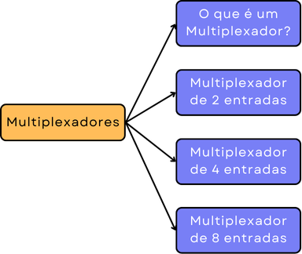

# Multiplexadores
Projeto da matéria de Sistemas Digitais para desenvolver um projeto que simule o sistema digital conhecido como multiplexador ou MUX

## Fluxograma

## O que é um multiplexador?

- Dispositivo eletrônico que **seleciona** uma entre várias entradas e a direciona para a saída.  
- Pode operar com sinais **analógicos ou digitais**.  
- Um MUX com \(2^N\) entradas precisa de **N sinais de seleção** para escolher a saída.  
  - Exemplo:  
    - Para 2 entradas → 1 sinal de seleção  
    - Para 4 entradas → 2 sinais de seleção  
    - E assim por diante  

### Multiplexador de 2 entradas

- Dispositivo que **seleciona** entre **duas entradas** (\(E0\) e \(E1\)) e encaminha uma delas para a saída (\(X\)).  
- Possui **1 sinal de seleção** (\(S\)), que define qual entrada será enviada para a saída.  
- Funcionamento:
  - Se \(S = 0\), a saída será \(X = E0\).  
  - Se \(S = 1\), a saída será \(X = E1\).  
- **Tabela-Verdade**:

  | \(S\) | \(X\)  |
  |---|---|
  | 0 | \(E0\) |
  | 1 | \(E1\) |

- **Equação Booleana**:  
  X = E₀·S̅ + E₁·S, onde S̅ é o complemento da entrada de seleção S.

### Multiplexador de 4 entradas

- Dispositivo que **seleciona** entre **quatro entradas** (\(E0, E1, E2, E3\)) e encaminha uma delas para a saída (\(X\)).  
- Possui **2 sinais de seleção** (\(S0\) e \(S1\)), que determinam qual entrada será enviada para a saída.  
- Funcionamento:
  - Se \(S1 S0 = 00\), a saída será \(X = E0\).  
  - Se \(S1 S0 = 01\), a saída será \(X = E1\).  
  - Se \(S1 S0 = 10\), a saída será \(X = E2\).  
  - Se \(S1 S0 = 11\), a saída será \(X = E3\).  

- **Tabela-Verdade**:

  | \(S1\) | \(S0\) | \(X\)  |
  |---|---|---|
  | 0 | 0 | \(E0\) |
  | 0 | 1 | \(E1\) |
  | 1 | 0 | \(E2\) |
  | 1 | 1 | \(E3\) |

- **Equação Booleana**:  
  X = (E0 · S0' · S0') + (E1 · S0' · S0) + (E2 · S0 · S0') + (E3 · S0 · S0).\
  ' = ("Barrado ou Negado")

### Multiplexador de 8 entradas

- Dispositivo que **seleciona** entre **oito entradas** (\(E0, E1, E2, E3, E4, E5, E6, E7\)) e encaminha uma delas para a saída (\(X\)).  
- Possui **3 sinais de seleção** (\(S0, S1, S2\)), que determinam qual entrada será enviada para a saída.  
- Funcionamento:
  - Se \(S2 S1 S0 = 000\), a saída será \(X = E0\).  
  - Se \(S2 S1 S0 = 001\), a saída será \(X = E1\).  
  - Se \(S2 S1 S0 = 010\), a saída será \(X = E2\).  
  - Se \(S2 S1 S0 = 011\), a saída será \(X = E3\).  
  - Se \(S2 S1 S0 = 100\), a saída será \(X = E4\).  
  - Se \(S2 S1 S0 = 101\), a saída será \(X = E5\).  
  - Se \(S2 S1 S0 = 110\), a saída será \(X = E6\).  
  - Se \(S2 S1 S0 = 111\), a saída será \(X = E7\).  

- **Tabela-Verdade**:

  | \(S2\) | \(S1\) | \(S0\) | \(X\)  |
  |---|---|---|---|
  | 0 | 0 | 0 | \(E0\) |
  | 0 | 0 | 1 | \(E1\) |
  | 0 | 1 | 0 | \(E2\) |
  | 0 | 1 | 1 | \(E3\) |
  | 1 | 0 | 0 | \(E4\) |
  | 1 | 0 | 1 | \(E5\) |
  | 1 | 1 | 0 | \(E6\) |
  | 1 | 1 | 1 | \(E7\) |

- **Equação Booleana**:  
  X = (E0 · S2' · S0' · S0') + (E1 · S2' · S0' · S0) + (E2 · S2' · S0 · S0') + (E3 · S2' · S0 · S0) + (E4 · S2 · S0' · S0') + (E5 · S2 · S0 · S0') + (E6 · S2 · S0' · S0) + (E7 · S2 · S0 · S0).\
' = ("Barrado ou Negado")

# Utilização do sistema

## Página Inicial do Projeto  

A página inicial do projeto funciona como um **menu de seleção** para os diferentes tipos de multiplexadores. Ela apresenta uma explicação introdutória sobre o que é um **multiplexador** e seu uso em sistemas digitais.  

Os **botões** correspondentes a cada tipo de multiplexador servem como links que exibem os conteúdos específicos que estavam ocultos na página, onde cada multiplexador será detalhado com:  
- Explicação sobre seu funcionamento  
- Tabela-verdade  
- Diagrama interativo  

Na parte inferior da página, há um **rodapé** com informações sobre a disciplina na qual o projeto foi desenvolvido, além de links para:  
- O repositório no **GitHub**  
- Rerência bibliográfica utilizada  

---

## Multiplexador de Duas Entradas  

O **Multiplexador de Duas Entradas** apresenta um **circuito lógico interativo**, onde o usuário pode alterar o estado do circuito clicando nos botões das entradas de seleção (**S, E₀ e E₁**).

### Funcionamento:
- Quando o usuário interage com os botões, **as conexões ativas no circuito ficam destacadas em azul**, colocando o nível lógico **alto (1)**.
- O **caminho azul** mostra **qual entrada está sendo definida** e como o sinal percorre o circuito até a saída (**X**).
- A **tabela verdade**, localizada à direita, muda de cor para destacar a linha correspondente ao estado atual do circuito.
- O circuito utiliza **portas lógicas AND e OR** para direcionar a saída conforme a seleção feita pelo usuário.

---

## Multiplexador de Quatro Entradas  

O **Multiplexador de Quatro Entradas** permite selecionar qual das quatro entradas de dados (**E₀, E₁, E₂, E₃**) será encaminhada para a saída **X**, dependendo dos valores das **entradas de seleção S₁ e S₀**.

### Funcionamento:
- O usuário pode alterar os valores das **entradas de dados (E₀, E₁, E₂, E₃)** e das **entradas de seleção (S₁ e S₀)**.
- Quando um valor é selecionado, o **caminho correspondente no diagrama fica iluminado**, destacando a entrada de dados que está sendo enviada para a saída.
- A escolha da entrada distribuída é baseada nos valores de **S₁ e S₀**, conforme a **tabela verdade** ao lado do circuito.
- O circuito utiliza **portas lógicas AND, OR e NOT**.

---

## Multiplexador de Oito Entradas  

O **Multiplexador de Oito Entradas** apresenta um **circuito lógico interativo**, onde o usuário pode alterar o estado do circuito clicando nos botões das **entradas de seleção (S₂, S₁, S₀, Enable (E')) e nas entradas de dados (E₀ a E₇)**.

### Funcionamento:
- Quando o usuário interage com os botões, **as conexões ativas no circuito ficam destacadas em azul**, indicando **o caminho lógico ativado** e como o sinal percorre o circuito até a saída (**Z**).
- A **tabela verdade**, localizada à direita, muda de cor para destacar a linha correspondente ao estado atual do circuito.
- O circuito utiliza **portas lógicas AND e OR** para direcionar a saída conforme a combinação dos bits de seleção.
- O multiplexador possui **três entradas de seleção (S₂, S₁ e S₀)** que determinam **quais das oito entradas de dados (E₀ a E₇) serão transmitidas para a saída Z**.
- Além disso, há um **sinal de Enable (E')**, que **habilita ou desabilita a saída**.
